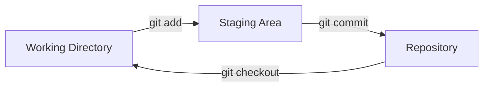

## Step 2: Creating Your First Repository

Now that we are familiar with the sample project and informed Git who we are, let's get our game into version control!

### 📖 Theory: The Git Workflow

The Git workflow involves three main areas:

- **Working Directory**: Your project files where changes are made.
- **Staging Area (Index)**: A preparation area for grouping changes to be committed to history.
- **Repository**: The permanent record of your project's development history.



### Essential Git Commands

Git has many commands, but there are a few you will use most often when working on local projects:

- `git init` - Initializes a new Git repository to enable version control.
- `git add` - Adds changes to the staging area before committing them to history.
- `git commit` - Commits changes in the staging area to the project's history.
  - Commit message - A short description of the changes to help keep the project history organized.
- `git status` - Shows the status of the working directory and staging area.
- `git checkout` - Switches to a different branch or version of the project.

> [!TIP]
> Don’t underestimate commit messages! A clear, concise, and descriptive message will make your project history easier to understand and help you find future bugs!.

### ⌨️ Activity 1: Initialize a project repository (using the CLI)

Let's add version control to our game and commit the current version.

1. In the terminal, navigate to the project directory.

   ```bash
   cd /workspaces/stack-overflown
   ```

1. Initialize a new Git repository.

   ```bash
   git init
   ```

1. Check the repository status. Notice that it says "No commits yet" and suggests using `git add`.

   ```bash
   git status
   ```

   

1. Add the game files to the staging area. This prepares them for committing to the repository history.

   ```bash
   git add src/index.html
   git add src/index.js
   git add src/patterns.js
   git add src/style.css
   ```

   or

   ```bash
   git add src/*
   ```

1. Check the repository status again. Each file is now marked as `new file`.

   ```bash
   git status
   ```

   

1. Commit the files to the repository history. Our project history has now been created! :octocat:

   ```bash
   git commit -m "Initial commit"
   ```

   

1. Check the repository status again. It shows "working tree clean", meaning the working directory matches the repository history.

   ```bash
   git status
   ```

   

### ⌨️ Activity 2: Work on a file (using VS Code)

Let's also try adding files with our code editor, in this case the documentation for our game.

1. In the file explorer, click the **New File...** icon to create a `README.md` file inside the `./stack-overflown/` folder.

   

1. Open the `README.md` file and add the following content:

   ```md
   # Stack Overflown

   Organize the falling blocks into the current debug pattern before the stack overflows! ⏳
   ```

1. In the left navigation, select the **Source Control** tab. Notice that the `README.md` file is listed under the **Changes** area.

   

1. Add the `README.md` file to the staging area by hovering over the file and selecting the `+` icon.

   

1. Enter a commit message in the input box and click the **Commit** button.

   ```txt
   Start game documentation
   ```

   

1. For a second commit, update the `README.md` file by adding the following content:

   ```md
   ## How to Develop

   - `index.html` - the game container for playing
   - `index.js` - the primary game logic
   - `patterns.js` - the error patterns to match during gameplay
   - `style.css` - the game formatting and styling
   ```

1. Add the change to the staging area and commit with the following message:

   ```txt
   Start developer docs
   ```

   

1. With your new commits added to the repository, Mona should already be busy checking your work. Give her a moment and keep watch in the comments. You will see her respond with progress info and the next steps.

<details>
<summary>Having trouble? 🤷</summary><br/>

- If `git status` shows the wrong files, you can unstage them with `git restore --staged <filename>`

</details>
